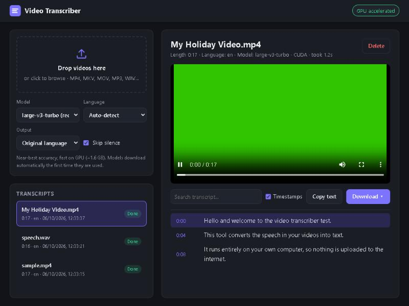

# Video Transcriber

Turn any video (or audio file) into a text transcript, entirely on your own computer.
Drop a file into the browser, watch the transcript appear line by line, then copy it or
download it as plain text, subtitles (SRT/VTT) or JSON.



- **Private and offline.** Speech recognition runs locally with
  [faster-whisper](https://github.com/SYSTRAN/faster-whisper) (OpenAI's Whisper model).
  Your videos never leave your machine. The internet is only used once to download each
  model.
- **Fast on NVIDIA GPUs**, and still works on any CPU.
- **No ffmpeg install needed.** Audio is decoded with the bundled PyAV libraries.
- **Auto-detects the spoken language** (Whisper supports about 99) and can translate any of them to English.
- **Web app and command line**, which share the same engine.

---

## Quick start

### Windows

1. Install **Python 3.10 or newer** from [python.org](https://www.python.org/downloads/).
   During setup, tick **"Add python.exe to PATH"**.
2. Download or clone this repository.
3. Double-click **`start.bat`**.

The first launch takes a few minutes. It creates a private Python environment in `.venv`,
installs the dependencies, and adds the GPU libraries if it finds an NVIDIA card. Your
browser then opens at **http://localhost:8765**. Later launches start in seconds.

### macOS / Linux

```bash
./start.sh
```

### Manual setup (any OS)

```bash
python -m venv .venv
# Windows: .venv\Scripts\activate      macOS/Linux: source .venv/bin/activate
pip install -r requirements.txt
pip install -r requirements-gpu.txt     # optional, NVIDIA GPUs only
python -m transcriber
```

---

## Using the web app

1. **Drop one or more videos** on the upload box, or click it to browse. You can also
   drop files anywhere on the page.
2. **Choose your options** (they're remembered for next time):
   | Option | What it does |
   | --- | --- |
   | **Model** | Bigger models are more accurate but slower. The recommended one is pre-selected for your hardware (see [Choosing a model](#choosing-a-model)). |
   | **Language** | Leave on *Auto-detect*, or pick the spoken language for slightly better accuracy. |
   | **Output** | *Original language* transcribes as spoken. *Translate to English* produces an English transcript from any language. |
   | **Skip silence** | Skips silent and music-only stretches. This is faster and stops Whisper inventing text during silence. Leave it on. |
3. **Watch it work.** Files are processed one at a time in a queue. The progress bar and
   transcript update live while it runs. Cancel stops a job at any point.
4. **Use the transcript:**
   - **Search** filters the transcript to matching lines and highlights the matches.
   - **Click a timestamp** to jump the video preview to that moment. The line being spoken
     is highlighted as the video plays.
   - **Copy text** copies the whole transcript, with or without timestamps (follows the
     *Timestamps* checkbox).
   - **Download** as:

     | Format | Use it for |
     | --- | --- |
     | Plain text `.txt` | Reading, notes, pasting into documents or AI tools |
     | Text with timestamps `.txt` | `[1:23] line…`, easy to scan and cite |
     | Subtitles `.srt` | Video players (VLC etc.), YouTube, video editors |
     | Web subtitles `.vtt` | HTML5 `<video>` captions |
     | JSON `.json` | Programs: segments with start and end times in seconds |

Finished transcripts stay in the **Transcripts** list (saved in `data/jobs/`), so they're
still there after a restart. Delete any you don't need. Uploaded videos are deleted as
soon as transcription finishes. The video preview is only available in the browser tab
you uploaded from.

> **Stopping the app:** close the console window, or press `Ctrl+C` in it.

---

## Command line

Process files without the browser, for example a whole folder in one go:

```bash
python -m transcriber transcribe lecture.mp4
python -m transcriber transcribe *.mp4 -f srt -f txt -o transcripts/
python -m transcriber transcribe interview.mkv --language de --translate --verbose
```

| Flag | Meaning |
| --- | --- |
| `-m, --model` | `tiny`, `base`, `small`, `medium`, `large-v3-turbo`, `large-v3`, `distil-large-v3` |
| `-l, --language` | Spoken language code (`en`, `es`, `de`, …). Default: auto-detect |
| `-f, --format` | `txt`, `timestamped`, `srt`, `vtt`, `json`. Repeat for several. Default: `txt` |
| `-o, --output-dir` | Where to write files. Default: next to each video |
| `--translate` | Output English, whatever the spoken language |
| `--no-vad` | Don't skip silence |
| `--device` | `auto` (default), `cuda` or `cpu` |
| `-v, --verbose` | Print each line as it's transcribed |

On Windows without activating the environment, use `.venv\Scripts\python -m transcriber …`
(or `start.bat transcribe …`).

### Server options

```bash
python -m transcriber --port 9000          # different port
python -m transcriber --no-browser         # don't open a browser tab
python -m transcriber --host 0.0.0.0       # allow other devices on your network (see Security)
python -m transcriber --device cpu         # force CPU
python -m transcriber --data-dir D:\transcripts
```

The environment variables `VT_DATA_DIR` and `VT_DEVICE` work too.

---

## Choosing a model

The first time you use a model it downloads automatically from Hugging Face and is
cached in `~/.cache/huggingface`.

| Model | Download | Speed | Accuracy | Good for |
| --- | --- | --- | --- | --- |
| `tiny` | 75 MB | ★★★★★ | ★☆☆☆☆ | Quick tests |
| `base` | 145 MB | ★★★★☆ | ★★☆☆☆ | Clear speech on slow PCs |
| `small` | 490 MB | ★★★☆☆ | ★★★☆☆ | **Default on CPU** |
| `medium` | 1.5 GB | ★★☆☆☆ | ★★★★☆ | Accuracy on CPU, if you can wait |
| `large-v3-turbo` | 1.6 GB | ★★★★☆ (GPU) | ★★★★★ | **Default on GPU** |
| `large-v3` | 3 GB | ★☆☆☆☆ | ★★★★★ | Maximum accuracy, hard audio |
| `distil-large-v3` | 1.5 GB | ★★★★☆ (GPU) | ★★★★☆ | English only |

Rough speed: on an RTX 3060, `large-v3-turbo` transcribes an hour of video in a few
minutes. On a CPU, `small` runs at about real-time speed or faster, depending on the processor.

---

## How it works

```
 Browser (static/index.html + app.js)
   │  1. POST /api/jobs (multipart upload + options)
   │  2. GET  /api/jobs/{id}?since=N   ← polled every second; returns new segments only
   │  3. GET  /api/jobs/{id}/download/{txt|timestamped|srt|vtt|json}
   ▼
 FastAPI server (transcriber/server.py)
   │  saves the upload to data/uploads/, queues a job
   ▼
 JobManager (transcriber/jobs.py)
   │  one background worker thread, FIFO queue, cancel flags,
   │  job history persisted as JSON in data/jobs/
   ▼
 Engine (transcriber/engine.py)
   │  • picks the GPU (CUDA float16) if cuBLAS/cuDNN can be loaded, otherwise CPU (int8)
   │  • keeps one Whisper model loaded in memory and reuses it between jobs
   │  • faster-whisper → PyAV decodes the audio track straight from the video
   │  • Silero VAD skips silence; segments stream back with progress
   │  • if the GPU fails mid-run, it retries automatically on CPU
   ▼
 Formatters (transcriber/formats.py) → TXT / SRT / VTT / JSON
```

### Project layout

```
video-transcriber/
├── start.bat / start.sh       one-click launchers (first run installs everything)
├── requirements*.txt          runtime, GPU and dev dependencies
├── pyproject.toml             packaging (`pip install .` gives a `video-transcriber` command)
├── transcriber/
│   ├── __main__.py            entry point: web server (default) and CLI
│   ├── server.py              REST API and static file serving
│   ├── jobs.py                background queue and history
│   ├── engine.py              faster-whisper wrapper, GPU detection, fallback
│   ├── formats.py             transcript renderers
│   └── static/                web UI (plain HTML/CSS/JS, no build step)
├── tests/                     pytest suite (the API tests use a fake engine, so no model is needed)
├── scripts/make_sample_video.py   builds a test MP4 from a WAV without ffmpeg
└── data/                      created at runtime: uploads + transcript history (git-ignored)
```

### REST API

| Method | Path | Description |
| --- | --- | --- |
| `GET` | `/api/info` | Device, default model, available models, languages, formats |
| `POST` | `/api/jobs` | Multipart form: `file`, optional `model`, `language`, `task` (`transcribe`/`translate`), `vad` |
| `GET` | `/api/jobs` | All jobs (summaries, newest first) |
| `GET` | `/api/jobs/{id}?since=N` | Status, progress, and segments from index `N` |
| `POST` | `/api/jobs/{id}/cancel` | Cancel a queued or running job |
| `DELETE` | `/api/jobs/{id}` | Delete a job and its transcript |
| `GET` | `/api/jobs/{id}/download/{fmt}` | Download as `txt`, `timestamped`, `srt`, `vtt` or `json` |

Interactive API docs are at http://localhost:8765/docs while the app is running.

---

## Development

```bash
pip install -r requirements-dev.txt
python -m pytest
```

To try the engine end-to-end without a real video, generate one. On Windows, PowerShell's
`System.Speech` can produce a speech WAV:

```bash
python scripts/make_sample_video.py speech.wav sample.mp4
python -m transcriber transcribe sample.mp4 -m tiny -v
```

---

## Troubleshooting

| Problem | Fix |
| --- | --- |
| Badge says **"Running on CPU"** but you have an NVIDIA GPU | Install the GPU libraries with `.venv\Scripts\python -m pip install -r requirements-gpu.txt` and restart. Also update your NVIDIA driver (CUDA 12 support needed). |
| First transcription seems stuck on "Loading model" | It's downloading the model (up to 3 GB for `large-v3`). Later runs start in seconds. |
| "Could not read an audio track from this file" | The file has no audio stream, or it's damaged or DRM-protected. |
| Out of GPU memory | Use `large-v3-turbo` or `small` instead of `large-v3`, or close other GPU-heavy apps. |
| Text repeats or appears during silence | Keep **Skip silence** on, and set the language explicitly. |
| Last words like "thanks for watching" are missing | Whisper models often skip typical video outros. It's a known model quirk. |
| Port 8765 already in use | `python -m transcriber --port 9000` |

## Security

The app listens only on `127.0.0.1` by default, so only your computer can reach it. It has
no login. If you start it with `--host 0.0.0.0`, anyone on your network can upload files
and read your transcripts, so do that only on networks you trust.

## License

MIT. See [LICENSE](LICENSE). Whisper models are released by OpenAI under the MIT license.
